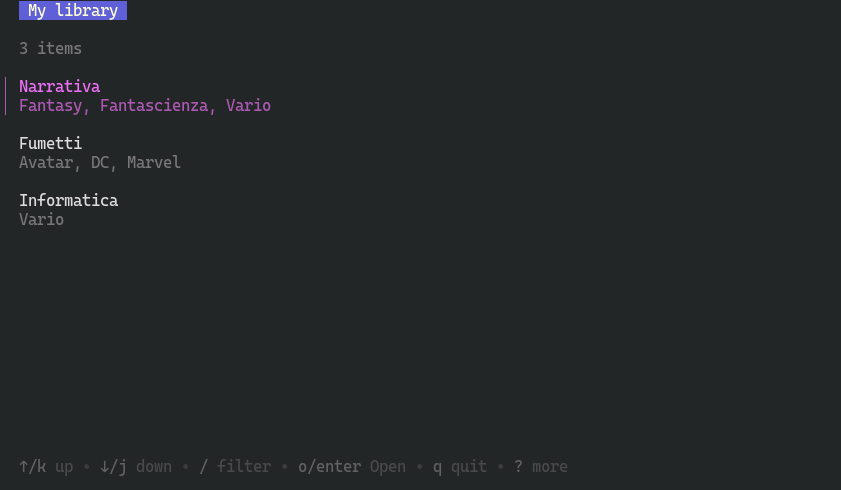
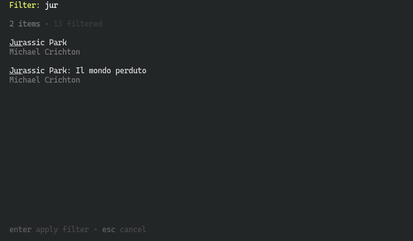
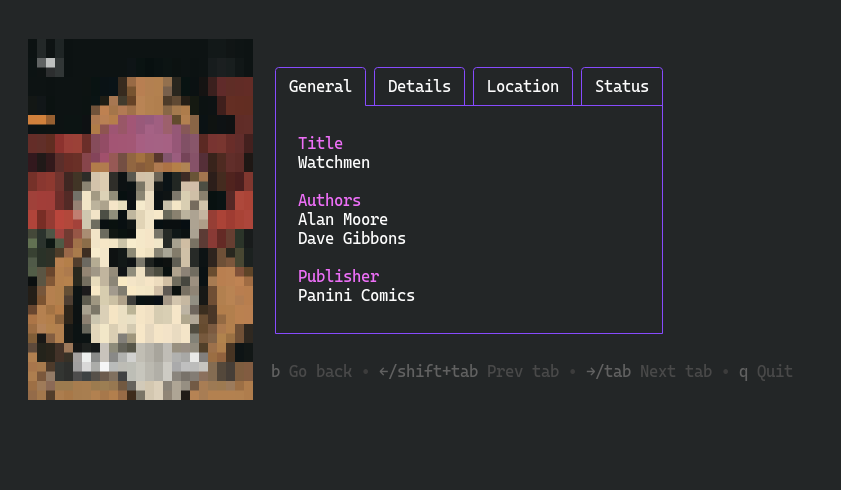

# Books

This repo contains a simple TUI to explore a hierarchical view of a books
collection.





## ... I am sorry, what?

Okay, so.

I had this books list, and I divided it into `libraries` (e.g. _Novels_ and
_Comics_), `groups` (e.g. _Fantasy_ and _Sci-Fi_ for the _Novels_ library) and
`sagas` (e.g. _Nevernight_).

With this project, I can search through the collections and view the books data
(with an ASCII thumbnail preview!).

To run it, you can simply execute

```
go run . <dbPath>
```

where `<dbPath>` is the path to the sqlite database.

## okay?

Yeah I know this is quite stupid, but I am working on it.

Right now the data is read-only: I'm still trying to build a pleasing interface,
the write functionalities will come later (if I'll ever get there).

## uhm, yes, but...

I understand that many of the things done (or thinked) in this project may not
fit everyone, or even anyone, but I preferred to start developing something
suitable for my needs, not the most general thing ever.

That said, I hope somebody else will use it some day.

## How did you do it?

The project relies on some [charmbracelet](https://charm.land) libraries, i.e.
[bubbletea](https://github.com/charmbracelet/bubbletea),
[bubbles](https://github.com/charmbracelet/bubbles) and
[lipgloss](https://github.com/charmbracelet/lipgloss).

I then made a `components` folder, containing some higher level models, and 
the `(n)models.go` files, that contains the final models, rendered to the user.

## Last notes

This project is released under the MIT license. See the `LICENSE` file for more
details.

Any contribution is highly appreciated.
